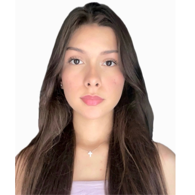
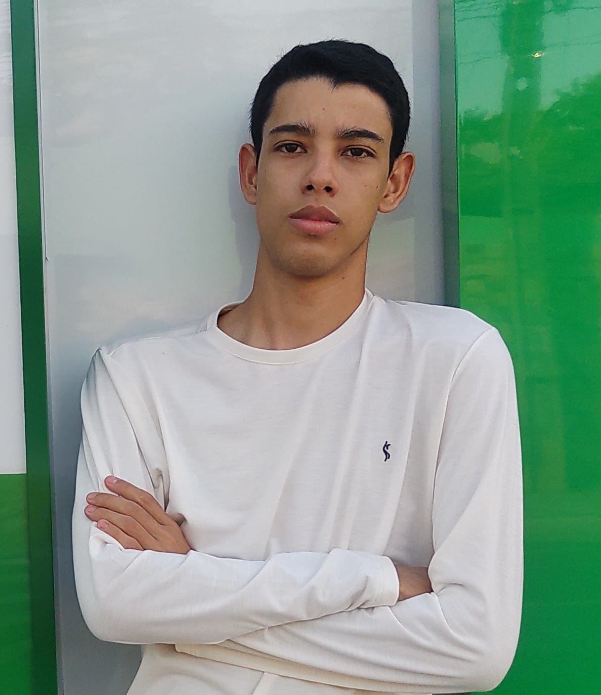
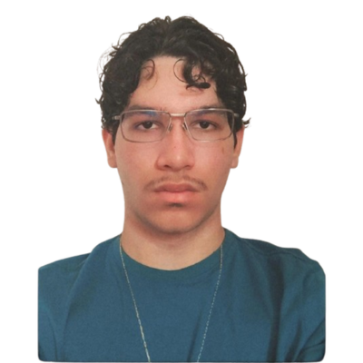
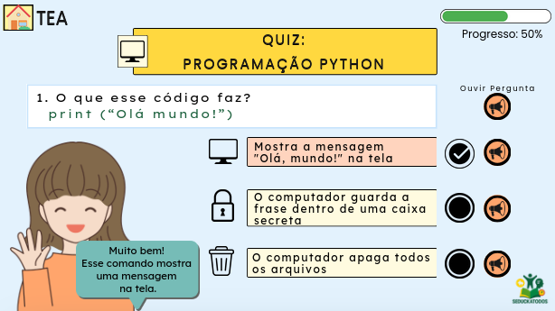
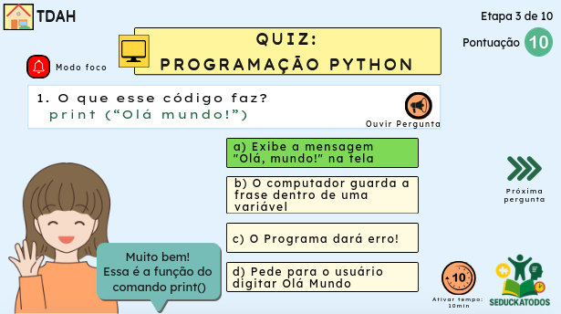
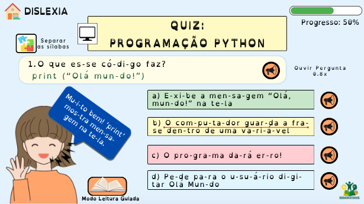

<h1 align="center">🎓 SEDUCKATODOS - Equipe OPALA FRONTLINE</h1>

Uma plataforma educacional acessível, feita com amor e inclusão real

---

## 🌐 Visão Geral

**SEDUCKATODOS** é uma plataforma web adaptativa, pensada para **estudantes com TEA, TDAH e dislexia**, desenvolvida por alunos do **CETI Angelina Mendes Braga (Pedro II/PI)**. Baseia-se no **Desenho Universal da Aprendizagem (DUA)**, utilizando **tecnologias leves e acessíveis** adequadas à realidade das escolas públicas do Piauí. A proposta nasceu do cotidiano escolar e utiliza IA (GPT-3.5-turbo), leitura por voz, mascotes afetivos e recursos personalizados para garantir **aprendizagem significativa e inclusão plena**.

---

## 📘 Introdução

Apesar dos avanços legais, estudantes neurodivergentes ainda enfrentam barreiras nos ambientes digitais de aprendizagem. O **SEDUCKATODOS** surge como resposta concreta, oferecendo:

- Interface adaptativa por perfil (TEA, TDAH ou Dislexia)
- Leitura em voz alta, pictogramas, separação silábica
- Painel do professor com reescrita automática por IA
- Mascotes (Ada, Alan e Eniac) como mediadores afetivos

A plataforma foi construída com base em vivências reais e diretrizes como **DUA, GAIA, NAAPI e WCAG 2.1**, sendo uma solução prática, escalável e de impacto social.

---

## 📌 Justificativa

📈 Segundo o Censo Escolar 2024, as matrículas de estudantes com TEA cresceram 44,4%. Ainda assim, muitas escolas carecem de ferramentas inclusivas.

O SEDUCKATODOS é:

- Viável para a rede pública
- Alinhado à LGPD, LBI e Agenda 2030 da ONU (ODS 4 e 10)
- Sustentável (custo mensal estimado: R$ 83,50)
- Apoiado por professores, psicopedagogos e pela comunidade escolar

---

## 🎯 Objetivos

**Objetivo Geral:**  
Desenvolver uma plataforma web educacional adaptativa que personalize o ensino de estudantes com TEA, TDAH e dislexia.

**Objetivos Específicos:**

- Interface adaptada por perfil cognitivo
- Painel docente com IA para reescrita e relatórios
- Funcionalidades como leitura em voz alta, pictogramas, temporizador e separação silábica
- Realizar testes com 30 estudantes e aplicar Escala SUS (meta ≥ 80)

---

## 👨‍👩‍👧‍👦 Equipe OPALA FRONTLINE

| Nome                        | Função                                        | Foto                                               |
|-----------------------------|-----------------------------------------------|----------------------------------------------------|
| Débora Lima de Almeida      | UX Writer e pesquisadora pedagógica           |            |
| Dalila Maria da Silva Andrande | Designer e prototipadora (Figma, Canva)  |              |
| Rafael Sousa Magalhães      | Programador Full Stack (PHP/JS/MySQL)         |      |
| Gustavo de Sousa Barros     | Testes e validação com usuários               |             |
| Camila Santiago Freire      | Documentação e organização do repositório     |          |
| Prof. Esp. Cleber da Silva Araujo | Orientador do projeto                  |          |

---

## 🧩 Funcionalidades

- ✅ Interface adaptada por perfil (TEA, TDAH, Dislexia)
- ✅ Leitura por voz (API SpeechSynthesis)
- ✅ Separação silábica automática
- ✅ Temporizador Pomodoro e Modo Foco
- ✅ Reescrita de textos com IA (GPT-3.5-turbo)
- ✅ Mascotes personalizáveis e motivacionais

---

## 🛠 Tecnologias Utilizadas

- PHP 8.4, HTML5, CSS3, JavaScript
- MySQL
- API OpenAI (GPT-3.5-turbo)
- speechSynthesis (JS)
- OpenDyslexic Font
- Figma + Canva (protótipos)

---

## 🖼️ Protótipos Iniciais

> Desenvolvidos no Figma e Canva, prontos para lapidação e implementação.

### Tela Inicial (perfil detectado automaticamente)

### Perfil TEA
- Cores neutras, 3 opções de resposta, pictogramas

### Perfil TDAH
- Modo foco, Pomodoro, barra de progresso

### Perfil Dislexia
- Separação silábica, fonte acessível, leitura lenta

---

## 🤖 Ada, Alan e Eniac: Mascotes que Inspiram

### 👩 Ada Lovelace
Mascote oficial, representa a sensibilidade e acolhimento. Oferece reforço emocional, leitura guiada e apoio afetivo aos estudantes.

### 👨‍💻 Alan Turing
Representa a lógica, inteligência e neurodivergência como potência. Inspira perseverança e superação.

### 🖥️ Eniac
Mascote extra, simboliza inovação e diversidade racial. Configurável e opcional.

---

## 📐 Metodologia

Baseada em **Design Science Research**, com 5 etapas:

1. Análise das barreiras enfrentadas pelos perfis
2. Modelagem do artefato com base em DUA, GAIA e NAAPI
3. Desenvolvimento com tecnologias acessíveis
4. Testes com 30 alunos por 90 dias (SUS ≥ 80)
5. Ajustes e sistematização dos resultados

---

## 📄 Documentação Técnica

- 📘 [Projeto Completo (PDF)](docs/projeto_final.pdf)
- ✍️ [Metodologia](docs/metodologia.md)
- 🎯 [Objetivos](docs/objetivos.md)
- 🧑‍💻 [Equipe e Funções](docs/equipe.md)

---

## 🌎 Alinhamento aos ODS da ONU

✔ **ODS 4 – Educação de Qualidade**  
✔ **ODS 10 – Redução das Desigualdades**

---

<strong>“Inclusão não é luxo. É um direito. E começa com acessibilidade real.”</strong>

