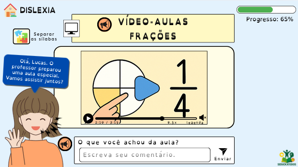

<h1 align="center">🎓 SEDUCKATODOS - Equipe: ANGELINA FRONTLINE</h1>

Uma plataforma educacional acessível, feita com amor e inclusão

---

## 🌐 Visão Geral

O SEDUCKATODOS é um ambiente digital adaptativo idealizado por estudantes do CETI Angelina Mendes Braga de Pedro II(PI), com foco na personalização do ensino para alunos com Transtorno do Espectro Autista (TEA), Transtorno de Déficit de Atenção e Hiperatividade (TDAH) e dislexia. A plataforma será desenvolvida com base nos princípios do Desenho Universal para a Aprendizagem (DUA), utilizando tecnologias acessíveis e de baixo custo, compatíveis com a realidade das escolas públicas do Piauí. O nome “SEDUCKATODOS” é um trocadilho com a palavra “Seduckathon” — competição estadual de inovação educacional da qual o projeto surgiu — e reforça o compromisso com a inclusão e a acessibilidade para todos os estudantes.

## 📘 Introdução

Apesar dos avanços legais voltados à inclusão escolar, muitos estudantes neurodivergentes ainda enfrentam barreiras invisíveis nos ambientes virtuais de aprendizagem. O SEDUCKATODOS surge como uma resposta concreta a esse desafio: uma **plataforma adaptativa e responsiva**, pensada para atender às necessidades de estudantes com **Transtorno do Espectro Autista (TEA)**, **Transtorno de Déficit de Atenção e Hiperatividade (TDAH)** e **dislexia**.

O sistema será desenvolvido com base nos princípios do **Desenho Universal para a Aprendizagem (DUA)** e nas diretrizes do **GAIA** e **NAAPI**, priorizando a personalização, acessibilidade e leveza técnica.

---

## 📌 Justificativa

Grande parte das plataformas educacionais não contempla as particularidades cognitivas dos alunos neurodivergentes, contribuindo para o distanciamento, evasão e desmotivação. A **SEDUCKATODOS** busca transformar esse cenário com uma proposta:

- Viável para escolas públicas
- Alinhada à legislação educacional
- Apoiada por professores e psicopedagogos
- Com recursos adaptados por perfil cognitivo

Alinhado aos **ODS 4 (Educação de Qualidade)** e **ODS 10 (Redução das Desigualdades)** da ONU, este projeto também representa uma proposta socialmente engajada e tecnicamente possível de escalar em nível estadual.

---

## 🎯 Objetivos

**Geral:**  
Desenvolver uma plataforma web educacional adaptativa que promova a personalização do ensino de estudantes com TEA, TDAH e dislexia, ampliando sua participação, permanência e aprendizagem significativa.

**Específicos:**

- Criar uma interface acessível por perfil cognitivo
- Incluir leitura por voz, pictogramas, temporizador, separação silábica e mascote digital
- Desenvolver painel docente para personalização do ensino
- Validar o sistema com estudantes reais da rede estadual do Piauí

---
---

## 👥 Equipe ANGELINA FRONTLINE

| Integrante | Função | Foto |
|-----------|--------|------|
| **Débora Lima de Almeida** | UX Writer, pesquisadora de acessibilidade pedagógica |  |
| **Dalila Maria da Silva Andrande** | Designer e prototipadora (Figma, Canva) |||
| **Rafael Sousa Magalhães** | Programador Full Stack (PHP/JS/MySQL) |  |
| **Gustavo de Sousa Barros** | Líder de testes e validação com usuários |  |
| **Camila Santiago Freire** | Documentação e organização do repositório |  |
| **Prof. Esp. Cleber da Silva Araujo** | Orientador do projeto | |

---

## 🧩 Funcionalidades

✅ Interface personalizada por perfil cognitivo  
✅ Leitura por voz (SpeechSynthesis API)  
✅ Separação silábica automática  
✅ Modo foco e temporizador Pomodoro  
✅ Painel do professor com painel pedagógico  
✅ Mascote Ada como reforço afetivo

---

## 🛠 Tecnologias

- PHP 8+, HTML5, CSS3 e JavaScript Vanilla
- MySQL
- API de leitura por voz (`speechSynthesis`)
- OpenDyslexic Font
- Figma + Canva para protótipos

---

## 🖼️ Protótipos da Plataforma feitas no Canva que depois serão lapidadas ao figma:

### 🧩 Tela Inicial (com detecção de perfil e saudação da mascote Ada)

---

### 👦 Perfil TEA

- Layout estável
- 3 alternativas por questão
- Fundo azul claro e pictogramas
- Ada como reforço visual

---

### ⚡ Perfil TDAH

- Temporizador Pomodoro
- Modo Foco ativável
- Barra de progresso
- Feedback imediato

---

### 📖 Perfil Dislexia

- Fonte OpenDyslexic
- Separação silábica e leitura lenta
- Fundo off-white
- Destaques visuais e auditivos

---

### 🎥 Vídeo-Aula com Acessibilidade (Dislexia)

---

# 🤖 Ada e Allan: As Mentes que Inspiram o SEDUCKATODOS

## 👩 Ada Lovelace – A Primeira Programadora da História

Augusta Ada King, Condessa de Lovelace — conhecida como **Ada Lovelace** — foi uma matemática britânica que, no século XIX, escreveu o **primeiro algoritmo** para ser processado por uma máquina. Mesmo sem computadores em sua época, ela imaginou o que mais tarde chamaríamos de **software**.

> “A máquina analítica tece padrões algébricos, assim como o tear de Jacquard tece flores e folhas.”  
> — *Ada Lovelace, 1843*

No projeto **SEDUCKATODOS**, Ada é muito mais que um nome: é a **mascote virtual da plataforma**. Com visual amigável e linguagem acolhedora, **Ada guia, incentiva e conforta** os estudantes neurodivergentes, tornando-se um elo emocional e cognitivo entre eles e a tecnologia.

**Funções da Ada na plataforma:**
- Oferecer reforço positivo e motivacional
- Adaptar mensagens conforme o perfil do aluno (TEA, TDAH ou dislexia)
- Ajudar na leitura automatizada de instruções
- Representar a presença feminina na ciência e na tecnologia

Na versão 2.0, Ada contará com **inteligência artificial leve** para ajustar seu comportamento com base nas interações dos alunos.

---

## 👨‍💻 Alan Turing – O Gênio que Venceu Códigos e Barreiras

**Alan Turing**, matemático britânico, é conhecido como o **pai da computação moderna**. Criador da máquina de Turing — conceito que fundamenta o funcionamento dos computadores atuais —, ele também foi decisivo na Segunda Guerra Mundial, ao decifrar os códigos da máquina Enigma usados pelos nazistas.

Turing era autista. Seu perfil neurodivergente foi historicamente marginalizado, e ele enfrentou grande preconceito. Ainda assim, seu legado mudou o mundo.

> “Às vezes, são as pessoas que ninguém imagina que fazem as coisas que ninguém consegue imaginar.”  
> — *O Jogo da Imitação (filme sobre Turing)*

No projeto **SEDUCKATODOS**, **Allan** representa:
- A genialidade das mentes neurodivergentes
- O potencial que floresce quando há acolhimento e respeito
- A urgência de tornar o ambiente escolar um lugar onde talentos não sejam desperdiçados
- O Mascote "Alan" também será implementado na versão 2.0. 

---

## ✨ Por que Ada e Allan?

- **Ada** inspira a parte afetiva e pedagógica da plataforma: acolhimento, mediação e motivação.
- **Allan** inspira o pilar lógico e computacional: programação, acessibilidade, propósito.

Juntos, representam a **força da diversidade cognitiva** e o compromisso da nossa equipe com uma educação que abrace todos os cérebros — dos mais analíticos aos mais sensíveis.

---

> Este documento é parte do projeto [SEDUCKATODOS](../README.md), criado por estudantes do CETI Angelina Mendes Braga – Pedro II/PI.

## 📄 Documentação

- 📘 [Projeto Completo em PDF](docs/projeto_final.pdf)
- ✍️ [Metodologia Detalhada](docs/metodologia.md)
- 🎯 [Objetivos do Projeto](docs/objetivos.md)
- 🧑‍💻 [Funções da Equipe](docs/equipe.md)

---

## 🌎 ODS da ONU

✔ ODS 4 – Educação de Qualidade  
✔ ODS 10 – Redução das Desigualdades

---

<strong>Inclusão não é luxo, é direito. E começa com acessibilidade real.</strong>

